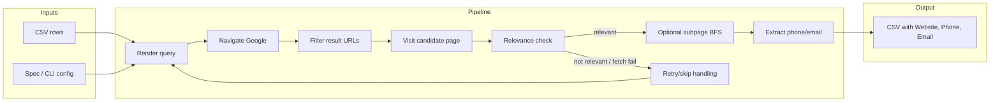

# HumanizedSeleniumScraper

> **Archived -- This project is no longer maintained.**
> It was archived on 2026-02-12 and released as-is. No bug fixes, security patches, or new features will be added.
> If you need active development, see the [Alternatives & Successors](#alternatives--successors) section below.

Automatically find websites, phone numbers, and email addresses for a list of businesses. You provide a CSV of company names and addresses; the scraper searches Google, visits the most relevant results, and writes the contact info it finds back to a new CSV.

Under the hood it drives a real Chrome browser with human-like typing, pauses, and scrolling to reduce the chance of being blocked.

## Features

- Human-like typing, pauses, and scrolling
- Cookie banner handling with fallback selectors
- URL filtering (TLD allowlist, domain keyword blacklist, query-part matching)
- Relevance scoring with keywords and optional address matching
- Subpage BFS on the same domain
- Phone and email extraction (including basic obfuscation patterns)
- Retry logic with skip-on-repeated-failure
- Incremental CSV output (header written once, rows appended)

## How it works



The scraper processes one input row at a time and keeps browser behavior intentionally human-like (typing, pauses, and scrolling). Result URLs are filtered and only relevant pages continue to optional subpage BFS and extraction. If navigation or relevance checks fail, the row falls into retry/skip handling and the run proceeds to the next row.

## Lifecycle

```mermaid
sequenceDiagram
  participant CLI
  participant Run
  participant Session
  participant Driver
  participant Google
  participant Page

  CLI->>Run: main then run(input_file, output_file, config, spec)
  Run->>Session: Session.create(config, profile_dir)
  Session->>Driver: create_driver(config, profile_dir)
  Run->>Run: Read CSV header / columns

  loop For each CSV row
    Run->>Run: render_template(query_template, row)
    Run->>Session: session.search(query, row, spec)
    Session->>Session: maybe_restart_driver()
    Session->>Driver: safe_get(google_url)
    Driver->>Google: Navigate to Google
    Session->>Driver: click_cookie_consent_if_present()
    Session->>Driver: human_type(search_box, query) ; submit
    Session->>Driver: Wait results ; get links
    alt Link passes url_filter (is_relevant_url)
      Session->>Driver: safe_get(href)
      Driver->>Page: Visit candidate
      Session->>Session: evaluate_page() ? search_subpages()
      Session->>Driver: parse_phone_email_deep()
      Session-->>Run: target_url, phone, email
    else Skip or retry
      Session-->>Run: None, None, None or SkipEntryError
      Run->>Run: log reason and continue
    end
    Run->>Run: _write_row(output_file, header, row_out)
  end

  Run->>Session: session.close()
  Session->>Driver: driver.quit()
```

Each run starts from CLI config and creates one reusable Selenium session. For every CSV row, the scraper builds a query, executes search, evaluates candidates, and writes exactly one output row. Failure paths are explicit: rejected links, navigation errors, and repeated failures return `None`/`SkipEntryError`, get logged, and the loop continues without terminating the batch.

## Requirements

- Python 3.12+
- Chrome/Chromium installed (Selenium Manager will fetch a compatible driver at runtime)
- Network access (Google + target sites)

## Installation

```bash
python -m venv .venv
source .venv/bin/activate  # Linux/macOS
# Windows: .venv\Scripts\activate

python -m pip install -r requirements.txt
```

Development dependencies:

```bash
python -m pip install -e ".[dev]"
```

## Quickstart

### 1. Prepare your input CSV

Create a file called `input.csv`. It can be either:

- **With a header row** (recommended) -- column names in the first line:
  ```
  name,street,plz,city
  Acme GmbH,Hauptstr. 1,10115,Berlin
  Widget Corp,Marienplatz 5,80331,Munich
  ```

- **Without a header** -- the scraper assumes four columns by default: `name`, `street`, `plz`, `city`.

### 2. Run the scraper

If your CSV **has a header row**:

```bash
python -m humanized_selenium_scraper --header --input input.csv --output output.csv
```

If your CSV **has no header** (uses the default four columns):

```bash
python -m humanized_selenium_scraper --input input.csv --output output.csv
```

A Chrome window will open and begin searching. Results are written to `output.csv` as they are found.

### 3. Other examples

Use the **keywords** preset when your CSV has `query` and `keyword` columns instead of address data:

```bash
python -m humanized_selenium_scraper --preset keywords --columns query,keyword --input input.csv
```

Use a **TOML spec file** for full control over search, filtering, and relevance settings (see `example_search_spec.toml`):

```bash
python -m humanized_selenium_scraper --spec example_search_spec.toml --header --input input.csv
```

Show all available options:

```bash
python -m humanized_selenium_scraper --help
```

## Configuration

Settings can be provided via CLI flags, a TOML spec file, or both. CLI flags override values from the spec file.

### Common CLI flags

| Flag | What it does | Example |
|------|-------------|---------|
| `--google-domain` | Google country domain to search | `--google-domain google.de` |
| `--query-template` | Python format string that builds the search query from CSV columns | `--query-template '{name} {city} kontakt'` |
| `--keyword-template` | Word(s) the page must contain to be considered relevant (repeatable) | `--keyword-template '{name}' --keyword-template 'contact'` |
| `--require-address` | Only accept pages that also mention the street/zip/city | `--require-address` |
| `--no-require-address` | Accept pages based on keywords alone (no address check) | `--no-require-address` |
| `--no-phone` / `--no-email` | Skip phone or email extraction | `--no-phone` |
| `--verbose` / `-v` | Print detailed debug output | `-v` |
| `--log-file` | Where to write the log (default: `scraper.log`) | `--log-file run1.log` |
| `--version` | Print version and exit | `--version` |

### TOML spec file

For full control, create a TOML file (copy `example_search_spec.toml` as a starting point) and pass it with `--spec`:

| Section | Controls |
|---------|----------|
| `[selenium]` | Google domain, browser restart frequency, retry count |
| `[search]` | Query template, phone/email extraction toggles |
| `[relevance]` | Keyword templates, hit thresholds, address matching |
| `[url_filter]` | Accepted TLDs, blacklisted domains, domain-matching mode |
| `[navigation]` | How many Google results to scan, links per page, subpage depth |

See `example_search_spec.toml` for a fully commented example.

## Output

The output CSV contains every column from your input plus three new columns: `Website`, `Phone`, and `Email`. Rows that could not be matched are still written (with empty values for the new columns) so you can see what was skipped.

The file is written incrementally -- one row at a time -- so you can monitor progress or safely interrupt a long run.

**Example** (input has columns `name`, `city`; output adds the three contact columns):

```
name,city,Website,Phone,Email
Acme GmbH,Berlin,https://www.acme-berlin.de,+49 30 1234567,info@acme-berlin.de
Widget Corp,Munich,,,
Foo AG,Hamburg,https://foo-ag.de/kontakt,+49 40 9876543,kontakt@foo-ag.de
```

In this example, Widget Corp had no relevant result -- the row is preserved with empty contact fields.

## Logging & Privacy

- Logs are written to the file given by `--log-file` (default: `scraper.log`) and also to stderr. Use `--verbose` or `-v` for debug logging.
- Query contents are redacted in logs (length and token count only).
- Output data may include phone/email; handle it according to your privacy requirements.

## Development & validation

Quick check (format, lint, tests):

```bash
ruff format .
ruff check .
pytest -q
```

Type checking:

```bash
mypy humanized_selenium_scraper
```

Build (optional):

```bash
python -m build
```

Tests run offline and do not launch a browser. See `Makefile` for more targets (`make ci`, `make test`, etc.).

## Security

For responsible disclosure see `SECURITY.md`. Optional local checks: `pip-audit -r requirements.txt`, `bandit -r humanized_selenium_scraper -x tests --severity-level medium`.

## Troubleshooting

- Driver issues: ensure Chrome/Chromium is installed and on PATH. If Selenium Manager fails, install a compatible ChromeDriver and add it to PATH.
- Captchas/throttling: increase delays, reduce query volume, and keep concurrency low.
- Cookie banners: update selectors in `click_cookie_consent_if_present()` if needed, including iframe handling.
- Element not interactable: use waits and the robust click helper (`click_element_robust`).
- Timeouts: increase page load timeout or reduce BFS depth/links per page.

## Alternatives & Successors

> This project is archived. Consider these actively maintained alternatives:

| Project | Description | Link |
|---------|-------------|------|
| SerpAPI | Managed Google search API, no browser needed | [serpapi.com](https://serpapi.com) |
| Playwright + stealth | Modern browser automation with anti-detection | [playwright.dev](https://playwright.dev) |
| Apify | Cloud scraping platform with Google search actors | [apify.com](https://apify.com) |
| ScraperAPI | Proxy-based search scraping service | [scraperapi.com](https://scraperapi.com) |

## Disclaimer

Automated scraping of Google may violate Google’s Terms of Service. Use responsibly and ensure you have permission to scrape target sites. This project is for educational purposes and does not provide any guarantee of success or access.

## License

See `LICENSE`.
